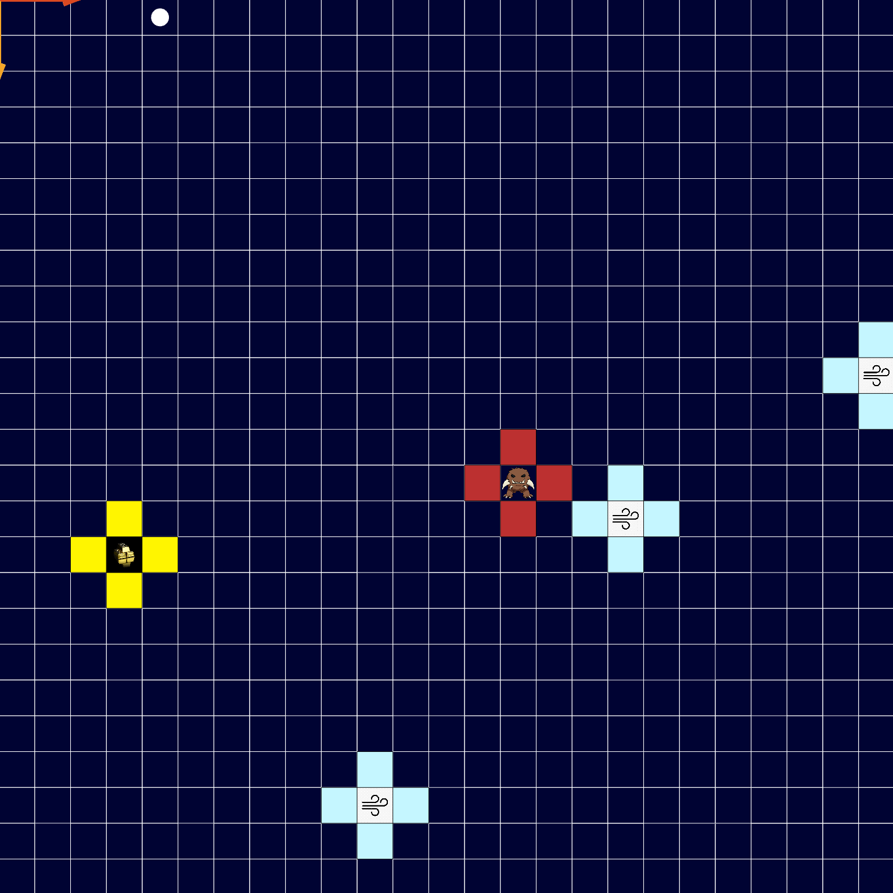

    <h1>Wumpus World Game</h1>
    <h3>Author: Christian Faccio</h3>
    <h5>Email: christianfaccio@outlook.it</h4>
    <h5>Github: <a href="https://github.com/christianfaccio" target="_blank">christianfaccio</a></h5>
    <h6>This project aims at simulating the classical Wumpus World using Gama Platform. In this game, an agent has to find the gold and grab it without falling into a pit or meeting the wumpus.<h6>

---

   

